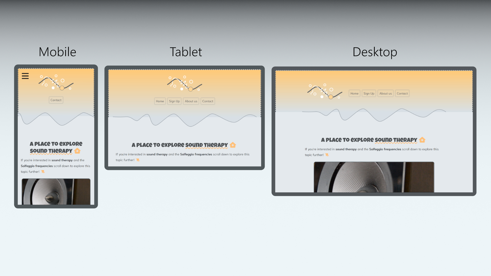
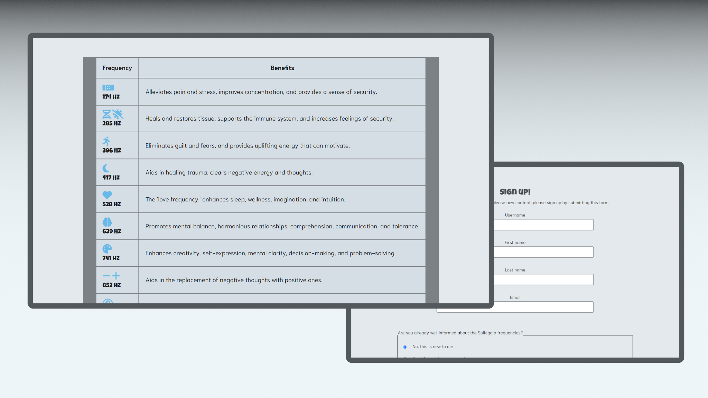
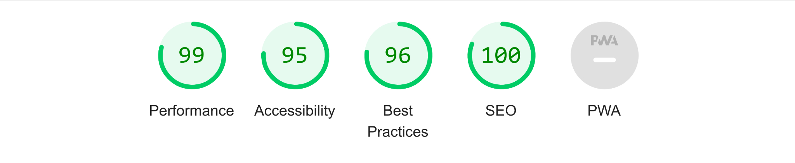

# Project Solfeggio frequencies 

## Disclaimer!
- This is a 'fictitious' demonstration project and it is not intended to act as a source of truthful or accurate information. 

## Introduction
This website targets people with an interest in sound therapy, specifically the **Solfeggio frequencies**. It is a simple project that attempts to spread useful information on this topic by mapping out famous frequencies in order, making them easy to remember.

The website should be referred to as an MVP (Minimum Viable Product) and the vision is to implement more intricate systems that can reach a wider audience. The aim is to develop more advanced systems that are suitable for environments such as spas, hotels, therapy centers, and other places that aim to promote health.

Click [here](https://kevinbjarnemark.github.io/Solfeggio-frequencies/) to visit the deployed version of this website.

## Features 

### Navigation system
All pages on this website share the same navigation system. It is a fully responsive system that collapses into a clickable hamburger icon on smaller screen sizes (mobile) and a typical navigation layout on larger screen sizes (desktop). When you click the hamburger icon on mobile, a container will appear, listing the page links in a column of rows instead of a single row. The links have a relatively large margin, making it easy to navigate on small devices.

### Header image
The header image represents a waveform that attempts to signal to the user's first impression that this website's theme is all about frequencies. Captivating users using their interest as bait (for good intentions of course).

### Content

##### Landing page
- A text section introduces the user to the subject with very basic information about the Solfeggio frequencies.

- A table that maps out all the Solfeggio frequencies in order. Relevant icons are placed in each row to make it easy for the user to find a specific row and also to quickly grasp what the frequency is all about.

##### Sign up page
- On this page, the user can sign up to get notifications about the latest updates. The page is fully responsive and the input fields are adjusted based on the device's screen size. Aside from normal input fields (name, email, etc.) the user also gets to inform the platform of their previous experience with the Solfeggio frequencies.

##### About page
- This page gives the reader a background of how the project started, the reasoning behind it, and the team's vision behind the platform.

## Vision

As of right now, the website is very minimalistic and the user should have the option to dive into more advanced realms. Here's a breakdown of some features that could benefit from further development.

#### Frequency table
- More visual integration with cymatics images. Cymatics is the patterns that the frequencies create through their vibrations. This can be achieved by pouring salt on a frequency generator plate. 
- Sound integration.
- Drag and drop functionality with the possibility to save and categorize frequencies. 

#### Sign up  
Users should be able to visit a personal account page and manage their accounts in alignment with industry standards. 

#### Long term
Many possibilities lay ahead If the project becomes successful. As already mentioned, the intent is to integrate more intricate systems as the audience grows. Below is a list of how this progress may look like.

- Provide an MVP to a targeted audience.
- Improve the system with the help of user feedback.
- Implement new features and expand the targeted audience.

In the case of the project becoming successful, organizations that aim to promote health would be allowed to access special systems on the site. Therapists who seek to combine their methods with sound therapy might want to, in a more controlled way, configure these systems with their daily routines. 

## Credits and resources

### Fonts

The following fonts from Google Fonts were used in this project:

- [Niramit](https://fonts.google.com/specimen/Niramit)
- [Luckiest Guy](https://fonts.google.com/specimen/Luckiest+Guy)

### References

All references to articles are accessible through clickable links within the website.

### Images, icons, videos, logo and favicon Information

- The logo and images used in this project was illustrated/drawn in image editing softwares by the creator of this Githgub repository Kevin Bjarnemark.
- The video found on the landing page was downloaded from Pexels [(Link)](https://www.pexels.com/video/vibrating-speaker-856298/), click [here](https://www.pexels.com/@pixabay/) to explore more videos from this creator.
- The icons used in this project was found at Fontawesome [(link)](https://fontawesome.com/),

### Social Icons

- All social media icons used in this project are branding resources provided by the respective companies. Since this is a sensitive area in terms of copyright, these icons have not been compressed, edited, or reformatted. **This negatively impacts SEO and performance but ensures compliance with copyright laws.**

### Code

## Testing 

The website has been tested throughout the development process with the tools listed below. 

- [W3C validator](https://validator.w3.org/)
- [Jigsaw validator](https://jigsaw.w3.org/css-validator/)
- [Lighthouse](https://chromewebstore.google.com/detail/lighthouse/blipmdconlkpinefehnmjammfjpmpbjk)

Here's a screenshot of the score from Lighthouse tested locally. It is **important** to note that the score may be may not be as favorable when testing the deployed site (with the extension tool). Regarding website improvement, it would be a **priority** to put effort into eliminating layout shifts and other problems totally.

## Deployment

[GitHub](https://github.com/) pages is the service that was used when deploying this website. Here are some pointers on how to go about doing this. 
- In the settings, select the default branch (main).
- Wait until the website has been built.
- Now the website will be automatically deployed as you're pushing changes to your Github repository. 

## Maintenance 

Due to this project's minimalistic characteristics, it would be optimal to introduce Javascript for future development. This was intended to be a pure HTML and CSS project and to manage close buttons and conditional logic can be quite comprehensive as the project grows in size.

Nevertheless, the code for this project was built with sustainability in mind. For example, CSS classes and IDs are locked in groups to promote further development without having to reorganize previous code.